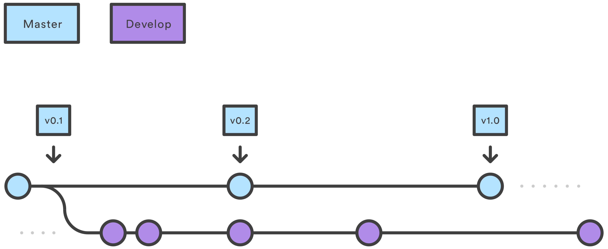

# Git Guide

If you are well aware of the difference between a **distributed** and **centralized** version control system, skip to the beef at [Workflows](#workflows).

-  [Introduction](#introduction)
-  [Workflows](#workflows)
  -  [Centralized Workflow](#centralized-workflow)
  -  [Feature Branch Workflow](#feature-branch-workflow)
  -  [Gitflow Workflow](#gitflow-workflow)

## Introduction

Git is what we call a **distributed version control system (DVCS)**.

Github, on the other hand, is a third-party service that provides (free and paid) Git repository hosting services to the public. *It is completely separate from Git* ([so much so that the developer of Git isn't so fond of Github](https://github.com/torvalds/linux/pull/17#issuecomment-5654674)). There are many, many other such hosting services. In fact, you can just as well run a git *host* on your own private server.

For this organization's purposes, we will currently primarily focus on using Github's hosting services. Workflow is, however, maintained through the git *tool*, and it is not recommended (at least in the long run) to work *through* Github (i.e. don't edit, commit, etc., through Github's web GUI).

Github should primarily be used for the following:

-  Issue Tracking
-  Pull Requests
-  Hosting live Repositories

and so on.

### Why is it "distributed"?

Git contrasts with other very popular version control systems like Subversion, which we say is a **centralized version control system (CVCS)**.

A centralized VCS works rather intuitively and straightforwardly:

1.  Download the file you want to change from the server. (Checkout)
2.  Make some changes to the file you downloaded. (Edit)
3.  Commit the edited file to the server. (Checkin)

This Checkout-Edit-Checkin workflow is simple, but comes with a host of limitations that distributed VCSs try to solve. (We won't go into the details of those limitations.)

A distributed VCS workflow tends to be something like this:

1.  Edit your local file (Edit)
2.  Merge any changes from upstream (Merge)
3.  Commit the total changes (Commit)

Since repositories are distributed, many other people may be working on the same file as you simultaneously and it would be necessary to **merge** their changes if they committed before you. Then your set of files are officially up-to-date, and can be safely committed (and in git terminology, "pushed") upstream.

And this is one major reason it's distributed, or *de*centralized: many people may have copies of the repository on their local machines, all simultaneously working with potentially the same file(s).

The tale is longer than this, but you'll get the gist of it as you read on.

## Workflows

All version control software worth its salt comes with some form of branching mechanism. How they handle them is different.

For example, Subversion hosts branches *within* the overall repository's folder structure. What we call the `master` branch in git, we call the `trunk` folder in Subversion. What we may call the `dev` branch in git, is what we may call a subfolder inside of the `branches` folder in Subversion. This is not a Subversion lesson, but it helps to understand that VCSs come in many flavors with their own ways of handling a fundamental version control concept.

But when branches come into play in a distributed system like git, it helps to have an agreed upon workflow for the team in question. Otherwise, everyone will be stepping over each other's toes.

Most importantly, grasping the branching concept gives you great developmental power and efficiency; although there's the overhead to learn it, the results are quite worth it.

### Centralized Workflow

Although git is distributed, it is easy for one to adopt a simple, centralized workflow akin to what users of Subversion use. In fact, most people who work alone using git as their version control software, follow this workflow, more or less.

The Centralized Workflow is best demonstrated through an example:

#### An Example

John is in New York working for a company hosted somewhere in the middle of the USA. Steve lives in California and is also hired as a remote software developer for the same company. They are assigned to the same project.

> John: Let's start our new assignment.
>
> John: `git init AwesomeNewProject`
>
> John: `cd AwesomeNewProject`
>
> John: `cat "# Awesome New Project" >> README.md`
>
> John: Alright, this looks ready to go!
>
> John: `git add README.md`
>
> John: `git commit -m 'Initial commit'`
>
> John: `git remote add github git@github.com:John/AwesomeNewProject.git`

John's setup a project, and in the last step, he connected himself to Github's servers for some upcoming upstream action:

> John: `git push github master`
>
> John: Alright, my repo's live!

And in fact it would be, in particular at www.github.com/John/AwesomeNewProject. But don't look there, this is a fake story.

Meanwhile, a few thousand miles away:

> Larry: I hope John started that project. He told me over the phone that it'd be named 'AwesomeNewProject' under his profile on Github. Let's see if we can get it.
>
> Larry: `git clone git@github.com:John/AwesomeNewProject.git` (success)
>
> Larry: Great, it worked!
>
> Larry: `cd AwesomeNewProject && ls`
>
> Larry: Just a `README.md` file... alright let's get something started.
>
> Larry: `vim main.cpp`
>
> Larry: ...
>
> Larry: Ok, done. Let's push this.
>
> Larry: `git add -A`
>
> Larry: `git commit -m 'Skeletal main.cpp'`
>
> Larry: `git push -u origin master`

Note that Larry calls his remote "origin" whereas John called his remote "github". This literally doesn't matter, it's just about what that remote *references*. In this case, both of them reference `git@github.com:Larry/AwesomeNewProject.git`.

John comes back into the picture:

> John: I should probably add some detail to that `README.md` file.
>
> John: `vim README.md`
>
> John: ...
>
> John: Ready to go. Let's do this.
>
> John: `git commit -a -m 'Adding some basic info on the project'`
>
> John: `git push github`

~~~
To git@github.com:John/AwesomeNewProject.git
 ! [rejected]        master -> master (fetch first)
error: failed to push some refs to 'git@github.com:John/AwesomeNewProject.git'
hint: Updates were rejected because the remote contains work that you do
hint: not have locally. This is usually caused by another repository pushing
hint: to the same ref. You may want to first integrate the remote changes
hint: (e.g., 'git pull ...') before pushing again.
hint: See the 'Note about fast-forwards' in 'git push --help' for details.
~~~

> John: What's that? Oh, sneaky Larry. He started work on this before me. Alright, let's grab his work.
>
> John: `git pull --rebase github master` (success, no conflicts)
>
> John: Oh nice, he already started on `main.cpp`! We're well on our way.

Since Larry already committed his changes to the same branch John is working on (`master`), git disallowed John from pushing unless he caught up ("pull"ed) with the most recently pushed commits from others. Once he pulled Larry's additions, git no longer complained.

**Important Note**: Notice that John gave the `git pull` command the option `--rebase`. This is one of those git-has-a-bad-UI things, in my opinion. If you type just `git pull ...`, git will not only **fetch** changes (which means to essentially download any changes from upstream, but not do anything with them to your actual working directory), but it'll also immediately merge them with what you currently have. This causes git to have an extra "merge commit" for everytime you pull, on top of all the commits you seek to push. Long story short, this gets messy, but others may disagree. Some will say, "No, this extra commit can be useful information, letting us know *when* things were merged", while others would share my sentiment and call it dirty when all you intended was to update your copy. Sometimes the same people change their opinion according to circumstance. Clearly, John's on my side here! We've yet to see where Larry stands.

In the end, it's up to you: do you want that extra commit indicating that you pulled and automatically merged, or not? If not, give git the `--rebase` or `-r` option each time you pull.

This is *not* the last time you'll have to deal with something like this using git. Just pick a way that matches your personal concerns, and stick with it, unless the project requirements clearly insist otherwise. In that case, it may be necessary to follow the project's workflow. That is the point of this document: to decide on practices and workflows for the team.

Let's continue by looking at a more complicated but powerful workflow.

### Feature Branch Workflow

Whereas in the Centralized Workflow every developer is essentially working on the same branch, the **Feature Branch Workflow** allows for drastically more flexibility by virtue of a theoretically infinite number of branches each representing a distinct feature of the application.

Take the case of John and Larry from the Centralized Repository story:

#### Continued Example

John and Larry have been getting into some heated arguments over the phone, because each one of them keeps stepping on each other's toes.

John wanted to work on `main.cpp` after pulling Larry's changes which initialized `main.cpp`. However, Larry, all the way across the US, was doing the same, as that was his original intention in creating that file.

Before long, when one tried to pull the most recent changes with `git pull`, sparks flew and the resulting merge-conflicted-file looked like the middle of an active warzone. Of course no one wanted to blame him or herself, so bad words were exchanged.

In the end, Larry did some research and found out about the **`git branch`** command. Turns out, you can create a personal branch that allows you to escape pesks like John.

> Larry: `git branch new_feature`
>
> Larry: There you go, my own branch. Eh, I'm not checked into it.
>
> Larry: `git checkout new_feature`
>
> Larry: Nice. So let's get started.

Larry carries on doing his work here.

Eventually, Larry decides his changes need some pushing to the `master` branch, because they're done and ready to go. For this, he makes a pull request (PR) on Github. John can now take a look at this PR, comment on it, tell Larry to edit this or that, and so on, before Larry's work from the `new_feature` branch is merged to `master`.

And so that's what happens: Larry makes the PR, and after John inspects the changes, he realizes there's a crucial bug in Larry's commit. Larry hurriedly goes back to his code and makes some changes to fix that bug. He commits his changes, and the PR is automatically updated to reflect that. John can see the changes and verifies that all is good to go. He merges the changes using the **merge** technique provided by Github, and a new *merge commit* is added to the tip of `master` representing the merge itself.

**Important Note**: Notice that John merged the PR using the plain old merge technique. He could have used **rebase**, which would have avoided adding a brand new merge commit, and aligned the `master` branch's history linearly with the merge. If you are confused about all this, don't worry about it. If you ever think to yourself "My gosh, all these 'merge commits' littering my commit history is getting annoying", only then can you go ahead and research the **difference** between `merge` and `rebase`. [I recommend this reading.](https://www.atlassian.com/git/tutorials/merging-vs-rebasing)

**Important Note 2**: Larry only had a single feature branch. Theoretically, you can have an infinite number of feature branches, as far as your creativity and hard drive allow. The workflow is the same: the feature branch's 'owner' (there doesn't *have* to be a owner, though) commits changes, submits a PR, gets a review, possibly goes back to fix stuff, and eventually (hopefully) gets his commit merged.

### Gitflow Workflow

The Gitflow Workflow is an expansion on the Feature Branch Workflow. It is meant to be *robust*, with clear rules and guidelines, and a nice framework for many organizations to work off of.

The Feature Branch Workflow allowed for a lot of callobratory effort, as discussed above. But of course, just having a bunch of feature branches like this is an extreme case of disorganization; we need some way of *collecting* them together to meaningful batches.

#### Developer Branch

For that, we introduce the **Developer** branch.

(all images of this format from www.atlassian.com)

The `dev` branch serves as an integration point for features. Meanwhile, `master` serves as the "official" version of the product in question. 

Here are some rules to follow when working under the feature branch 

1.  You don't push to `master` from anything *except* `dev`.

.......taking a break........